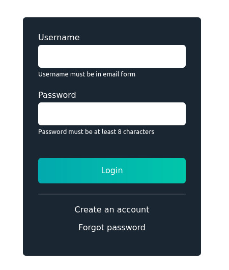

# React: Add Registration and Login to your React App

## About
To quickly integrate registration and login into your React application, IndyKite has created a modern, easy-to-use JavaScript UI-SDK.  Using the UI-SDK removes the complexity of building login and registration flows into your application.  Coupled with the customizable, drag-and-drop authentication flows built in the Admin Console you can use the SDK to add login and registration to your application in minutes.

To use this quickstart, you'll need:
* A free IndyKite account or log in to the IndyKite Admin Console
* An existing React application or you can setup one with Create-React-App (instructions in the next section)

## Prerequisites
* From the [IndyKite Admin Console](https://indykite.id), configure an AppSpace and downloaded your credential configuration.  Keep this file handy since you'll need to refer to it in a few steps. ([_How do I do this?_](https://indykite.one/blog/1253ad39-be3b-4652-88cb-85ad4b0e9232/?category=43af05a3-17b7-46e4-8995-6354f7f0212f)).
* Install Node.js (_Visit https://nodejs.org for instructions for your specific operating system_)
* Create a project folder. If you don't already have an application that you want to integrate then you can quickly create one. (_Using [create-react-app](https://github.com/facebook/create-react-app "Create React App") is a great way to bootstrap and get up and running quickly._)

_for example:_
```bash
yarn create react-app my-app
```

You can verify this was installed correctly by running:
```bash
yarn start
```


## Install IndyKite SDK
To install the front-end SDK and make it available to your application type the following command into a terminal window or command prompt, in the directory you created in the previous step:

```bash
yarn add @indykiteone/jarvis-sdk-web
```

In this sample we also use some additional libraries that you’ll need to install as well.

```bash
yarn add react-router-dom
yarn add browser-router
```

A quick way to verify that you have the correct version of the SDK you can use the 'yarn list' command to view all of the packages installed.

```bash
yarn list | grep indykite
```

This will return the name and version number of the IndyKite SDK package that has been added to the package.json, to be used in your app

```bash
@indykiteone/jarvis-sdk-web@0.1.14
```
_Note: your version may be different then what you see in the above example._

## Configure your environment with the agent config file
Using the values from the application agent credential config file that you downloaded from the Admin console, create a new file, in the project folder, called .env (dot env).  This file will need the necessary parameters your application will need to connect to the right application space and tenant. For each property copy the corresponding value from the downloaded file. 

_Note: Typically you would store this credential in a back end part of your application as any sensitive cannot be secured in a front-end app.  This is just for demonstrative purposes._

Example:
```bash
REACT_APP_BASE_URI=https://jarvis.indykite.com
REACT_APP_APPLICATION_ID=696e6479-6b69-4465-xxxx-020f00000000
REACT_APP_TENANT_ID=696e6479-6b69-4465-xxxx-030f00000001
```

## Integrate IndyKite with your application
If you change into the src directory of your application folder (my-app/src) you will see that a couple of default files were created for you.  We are specifically interested in the App.js and index.js files.  We have a few changes that we’ll add to those files. 

In the index.js file you need to initialize and pull in the application credentials from the environment file that you created earlier. We’ll do that by reading from the .env file at runtime. Add the following code snippets to src/index.js.

Setup your imports, including the IndyKite UI SDK
```ts
import React from 'react';
import ReactDOM from 'react-dom/client';
import { IKUIInit } from "@indykiteone/jarvis-sdk-web";
import { BrowserRouter as Router } from "react-router-dom";
```

Initialize with the values from the environment file 
```ts
IKUIInit({
  baseUri: process.env.REACT_APP_BASE_URI,
  applicationId: process.env.REACT_APP_APPLICATION_ID,
  tenantId: process.env.REACT_APP_TENANT_ID,
});

const root = ReactDOM.createRoot(
  document.getElementById("root")
);
root.render(
  <React.StrictMode>
    <Router>
      <App />
    </Router>
  </React.StrictMode>
);
```

While we are here, let’s go ahead import a couple of local files, that we’ll create a little later on. 

On top of App.js, add :

```ts
import React, { useEffect } from "react";
import { Routes, Route, Link, useNavigate, BrowserRouter } from "react-router-dom"; 
import { IKUIInit, IKUIUserAPI } from "@indykiteone/jarvis-sdk-web";
import {useLocation} from 'react-router-dom';
```

With the IndyKite SDK you have the option of using the out-of-the-box UI or creating your own custom UI.  In this example we are going to use the former.  

The following two pages will contain references to the SDK methods that automatically generate the UI components. 

```ts
import Login from "./components/Login";
import Registration from "./components/Registration";
```

Lets implement some basic access control functionality into our app.  Namely, user registration and login.

There should already be a function called App().   
```ts
function App() {
}
```

In the App function …

Before the return, add :
```ts
  const [token, setToken] = React.useState(null);
  const [refreshToken, setRefreshToken] = React.useState(null);
```
Then inside the return, add the Route inside a Routes.
We’ll use routes to create the endpoints that we need for this application.  
Each route will need a corresponding function so let’s add these routes now.  Add them after the line with “return (” inside a div or at least a <>

```ts
      <Routes>
      <Route path="/" exact element={<Home />}> </Route> 
      <Route path="/login" element={<Login setToken={setToken} />} />
      <Route path="/registration" element={<Registration setToken={setToken} />} />
      <Route path="/authenticated" element={<Authenticated />} />
      <Route path="/callback" element={<Callback setToken={setToken} />} />
      </Routes>
```
So App.js is now: 

```ts
function App() {
  
  const [token, setToken] = React.useState(null);
  const [refreshToken, setRefreshToken] = React.useState(null);
  
  return (
    <div>
      <header>
        <h1>Sample Login App</h1>
      </header>
  
      <Routes>
      <Route path="/" exact element={<Home />}> </Route> 
      <Route path="/login" element={<Login setToken={setToken} />} />
      <Route path="/registration" element={<Registration setToken={setToken} />} />
      <Route path="/authenticated" element={<Authenticated />} />
      <Route path="/callback" element={<Callback setToken={setToken} />} />
      </Routes>
    </div>
  );
}
```


Now we add the Home function for the route element Home
```ts
function Home() {
  const onLoginStart = React.useCallback(() => {
    const uiSwitch = localStorage.getItem("whatUiToUse");
    localStorage.clear();
    localStorage.setItem("whatUiToUse", uiSwitch);
   }, []);
  return (
    <>
       <div className="App">
        <h2>Welcome to the homepage!</h2>
        <p>You can do this, I believe in you.</p>
      </div>
      <nav>
        <Link to="/login">
           <button id="start-btn" onClick={onLoginStart}>
             Start
           </button>
          </Link>
      </nav>
    </>
  );
}
```
Now we add the Authenticated function for the route element Authenticated.

```ts
function Authenticated() {

  const navigate = useNavigate();
  const location = useLocation();
  const [token, setToken] = React.useState(null);
  const [data, setData] = React.useState(null);
  const [refreshToken, setRefreshToken] = React.useState(null);
 
 
}
```

Within the Authenticated function we need a few callbacks to handle login, logout, and token refresh. 

```ts
const onLogout = React.useCallback(() => {
    IKUIUserAPI.logoutCurrentUser()
      .then(() => {
        setToken(null);
        setRefreshToken(null);
        navigate("/login");
      })
      .catch(console.log);
  }, [navigate]);

  const onRefreshToken = React.useCallback(() => {
    IKUIUserAPI.getValidAccessToken({ refreshToken: refreshToken })
      .then((token) => {
        setRefreshToken(token);
        //setToken(null);
      })
      .catch(console.log);
  }, []);
```


Now we add a useEffect Hook to retrieve info from Login and Registration and add states to the function components
```typescript
 useEffect(() => {
    if (location.state) {
      setData(new Map(Object.entries(location.state.data)));
      setToken(location.state.token);  
      setRefreshToken(location.state.refresh_token);  
    }
  }, []);
```

Now we need some code to handle displaying the token values to the UI.  Put this code in the return:

```html
 return (
    <>
    {token || refreshToken ? (
      <>
      <div className="buttons-wrapper">
        <button id="refresh-token-btn" onClick={onRefreshToken}>
          Refresh token
        </button>
        <button id="logout-btn" onClick={onLogout}>
          Logout
        </button>
      </div>
      </>
    ) : (
      <>
        <h5>No token found</h5>
        <Link to="/login">go to login</Link>
      </>
    )}
    {data && (
        <div className="responseWrapper">
          <h4>Token</h4>
          <p id="token-field">{data.get('token')}</p>
          <h4>Refresh Token</h4>
          <p id="refresh-token-field">{data.get('refresh_token')}</p>
          <h4>Token Type</h4>
          <p id="token-type-field">{data.get('token_type')}</p>
          <h4>Token Expiration (timestamp)</h4>
          <p id="token-expiration-field">{data.get('expiration_time')}</p>
          <h4>Token Expires In (seconds)</h4>
          <p id="token-expires-in-field">{data.get('expires_in')}</p>
        </div>
      )}
      {refreshToken && (
        <div className="responseWrapper">
          <h4>Token</h4>
          <p id="token-field">{refreshToken}</p>
        </div>
      )}
    </>
  );
```

You’ll notice that the login and registration routes are calling additional logic.  These point to the two local files that we imported earlier.  We’ll go ahead and create those now.

To render the Login we can use the method renderLogin(). This method will create a login UI based on the default AuthFlow that you have configured for this AppSpace in the AdminConsole. This method has several properties and labels that can be used to customize the login form that is displayed to the user.

In the src directory create another directory called “components”.  Save the Login.js and Registration.js files to the components that you just created.  
Additionally, there are a couple of properties that can be used to add additional helper text to the form fields:

* userInputNote
* passwordInputNote 
* passwordCheckInputNote

**Note**: _These are temporary properties and could be removed in future versions._

Login.js
```ts
import React, { useEffect } from "react";
import { useNavigate } from "react-router-dom";
import { IKUICore } from "@indykiteone/jarvis-sdk-web";

  const Login = ({ setToken }) => {
  const navigate = useNavigate();
  const onSuccess = React.useCallback(
    (data) => {
      navigate("/authenticated", {state:{token:data.token, refresh_token:data.refresh_token, data: data}});
    },
    [navigate],
  );

  useEffect(() => {
    IKUICore.renderLogin({
      renderElementSelector: ".login-container",
      onSuccessLogin: onSuccess,
      redirectUri: "/callback",
      forgotPasswordPath: "/forgot",
      userInputNote: "Username must be in email form",
	  passwordInputNote: "Password must be at least 8 characters",
	  passwordCheckInputNote: "Passwords must match" 
      // labels: {
      //   username: "Custom Username",
      //   password: "Custom Password",
      //   loginButton: "Custom Login with us!",
      //     registerButton: "Custom Register",
      //     forgotPasswordButton: "custom Forgot Password",
      //     orOtherOptions: "Custom you can also continue with"
      // }
    });
  });

  
  return (
    <div>
      <div className="login-container" style={{ width: 350 }} />
    </div>
  );
};
export default Login;
```

Next, let's add the registration UI code.  Similar to the login, you can use the renderRegister() method to automatically generate the registration flow, based on the registration flow configured in the default AuthFlow in your AppSpace.
Registration.js
```ts
import React, { useEffect } from "react";
import { useNavigate } from "react-router-dom";
import { IKUICore } from "@indykiteone/jarvis-sdk-web";

const Registration = ({ setToken }) => {
  const navigate = useNavigate();
  const onSuccess = React.useCallback(
    (data) => {
      console.log(data) ;  
      navigate("/authenticated", {state:{token:data.token, refresh_token:data.refresh_token, data: data}});
    },
    [navigate],
  );

  useEffect(() => {
    IKUICore.renderRegister({
      renderElementSelector: ".register-container",
      onSuccessRegistration: onSuccess,
      redirectUri: "/callback",
      labels: {
        // username: "Custom Username",
        // password: "Custom Password",
        // confirmPassword: "Custom Confirm Password",
        // registerButton: "Custom Join",
        // alreadyHaveAnAccountButton: "Custom Already have an account",
        //     orOtherOptions: "Custom you can also continue with"
      },
      // termsAgreementSectionContent:
      // "<h5>By clicking Agree & Join you agree with our secret terms and conditions.</h5>",
    });
  });
  return (
    <div>
      <div className="register-container" style={{ width: 350 }} />
    </div>
  );
};
export default Registration;

```
At this point you can start your application with yarn. 
To start:
```ts
yarn start
```
If there were no issues with your code, this will open a browser with your application running where you should see a login form similar to what is shown below.

